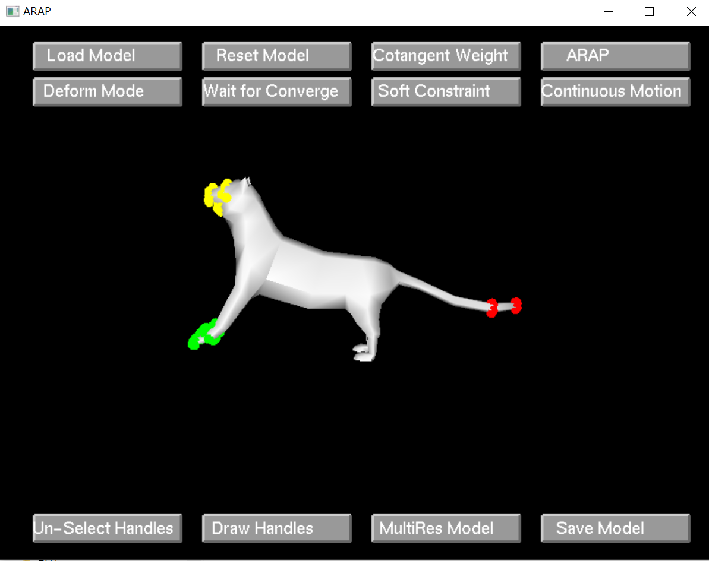

# Geometry-Modeling-Algorithm-and-tools-implementation
Implement different methods for 3d mesh grometric modeling with UI interface

1.

Feature based local deformation

2.

Laplacian Mesh Smoothing

3.

As rigid as possible surface modeling

ref:
https://people.eecs.berkeley.edu/~jrs/meshpapers/Sorkine.pdf
https://www.igl.ethz.ch/projects/ARAP/arap_web.pdf
https://igl.ethz.ch/projects/Laplacian-mesh-processing/Laplacian-mesh-editing/diffcoords-editing.pdf

